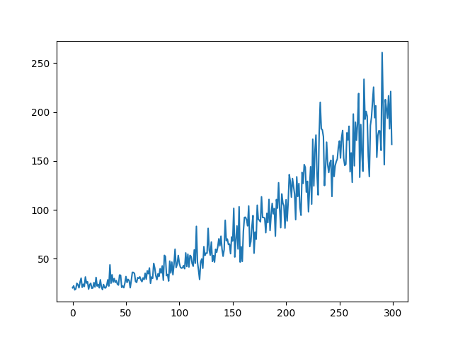

## OpenAI Gym Cartpole DA2C Algorithm

### Test Environment
```
Ubuntu22.04 WSL Distribution.
Python 3.11.4 with Pytorch, Gymnasium, numpy and matplotlib
```

### Result

Steps per epoch(average 10 epochs)