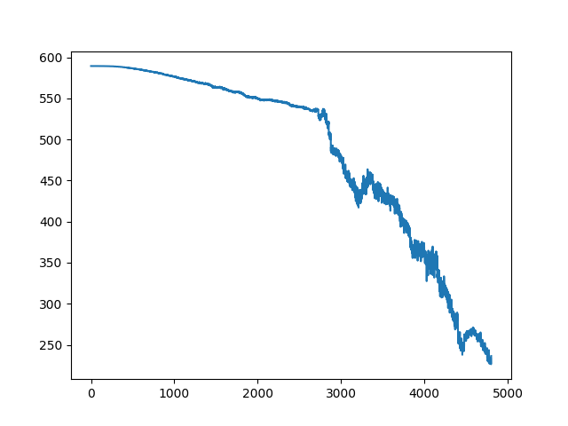
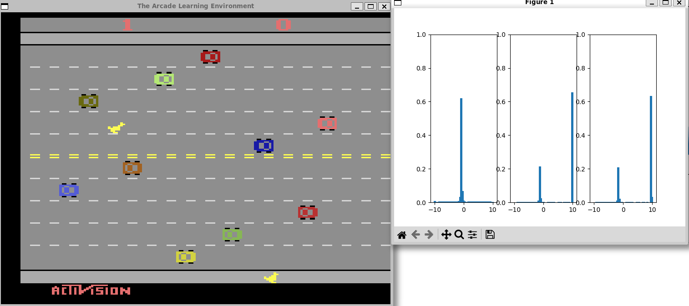

## OpenAI Gym Freeway Dist-DQN Algorithm

### Test Environment
```
Ubuntu22.04 WSL Distribution.
Python 3.9.18 with Pytorch, Gym[atari], numpy and matplotlib
```

### Result

loss graph


prob distribution with State.
